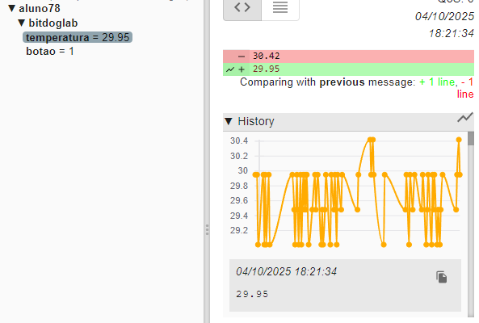
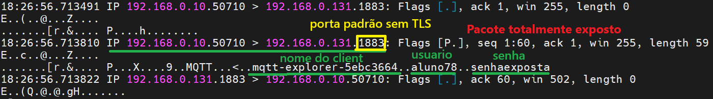
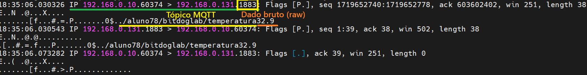
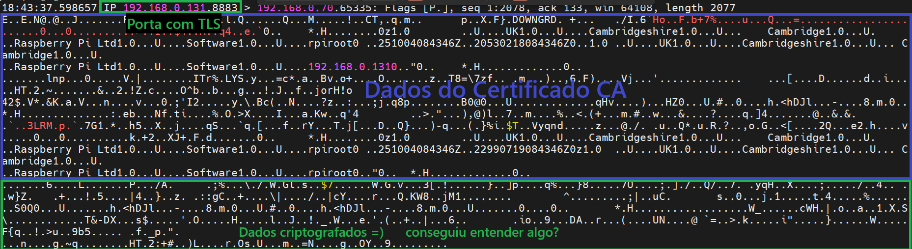
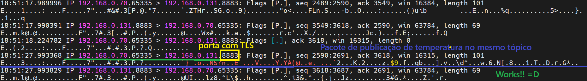
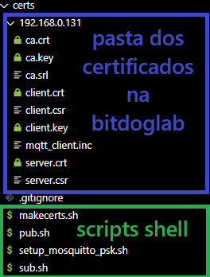

# README - Cliente MQTT TLS para Raspberry Pi Pico W

Este projeto implementa um cliente MQTT seguro (TLS) rodando no **Raspberry Pi Pico W**, lendo botões e temperatura, publicando no broker Mosquitto.

## 🔹 Funcionalidades

* Leitura de dois botões físicos.
* Leitura de temperatura onboard.
* Publicação MQTT via TLS (porta 8883) em tópicos configuráveis.
* Nome do dispositivo único opcional.

---

## ⚙️ Requisitos

* Raspberry Pi Pico W
* SDK do Raspberry Pi Pico C
* Compilador GCC para ARM
* Broker MQTT Mosquitto
* Certificados TLS (CA, servidor, cliente)

---
## 🔧 Configurações Importantes

### 🔐 Wi-Fi
```c
set(WIFI_SSID "NOME_DA_SUA_REDE_WIFI")
set(WIFI_PASSWORD "SUA_SENHA_DA_REDE")
```

### ☁️ Broker MQTT
```c
set(MQTT_SERVER "192.168.0.100") # Altere isso para o nome do host ou IP do seu servidor MQTT

```
> ⚠️ **Atenção:** Estas credenciais estão localizadas no CMakeLists.txt.


## 🛠️ Dependências
- [pico-sdk](https://github.com/raspberrypi/pico-sdk)
- [Mbed-TLS](https://github.com/Mbed-TLS/mbedtls)


## 🚀 Como Compilar

1. Instale o [Raspberry Pi Pico SDK](https://github.com/raspberrypi/pico-sdk).
2. Certifique-se de que `cmake`, `make` e `arm-none-eabi-gcc` estão disponíveis no sistema.
3. Clone este repositório e inicialize os submódulos se necessário.
4. Compile com:
   ```bash
   mkdir build
   cd build
   cmake ..
   make
   ```

## 📡 Imagens do código em funcionamento:

Visualização pelo MQTT Explorer...


Captura de pacote de solicitação de conexão Sem TLS ao broker MQTT via terminal...


Captura de pacote de publicação de dados Sem TLS no broker MQTT via terminal...


Captura de pacote de solicitação de conexão COM TLS ao broker MQTT via terminal...


Captura de pacote de publicação de dados COM TLS no broker MQTT via terminal...


Localização dos scripts para gerar os certificados e setup do broker MQTT...


## 🖥️ Configuração do Mosquitto

### Linux (Ubuntu/Debian)

1. Instalar Mosquitto:

```bash
sudo apt update
sudo apt install mosquitto mosquitto-clients
```

2. Criar diretório de certificados:

```bash
sudo mkdir -p /etc/mosquitto/certs
```

3. Copiar certificados (CA, server, client) para `/etc/mosquitto/certs`

4. Ajustar permissões:

```bash
sudo chown mosquitto:mosquitto /etc/mosquitto/certs/*
sudo chmod 600 /etc/mosquitto/certs/*
```

5. Configurar `/etc/mosquitto/mosquitto.conf`:

```conf
per_listener_settings true

listener 1883
allow_anonymous true

listener 8883
cafile /etc/mosquitto/certs/ca.crt
certfile /etc/mosquitto/certs/server.crt
keyfile /etc/mosquitto/certs/server.key
require_certificate false
tls_version tlsv1.2
allow_anonymous true

log_dest file /var/log/mosquitto/mosquitto.log
```

6. Reiniciar Mosquitto:

```bash
sudo systemctl restart mosquitto
```

7. Testar:

```bash
mosquitto_sub -h localhost -p 8883 -t test -v --cafile /etc/mosquitto/certs/ca.crt
mosquitto_pub -h localhost -p 8883 -t test -m "Hello TLS" --cafile /etc/mosquitto/certs/ca.crt
```

### Windows 10/11

1. Baixar e instalar Mosquitto [aqui](https://mosquitto.org/download/), escolha instalador Windows x64.
2. Adicionar `C:\Program Files\mosquitto\` ao PATH do sistema.
3. Criar pastas:

```
C:\mosquitto\config\
C:\mosquitto\certs\
```

4. Copiar certificados para `C:\mosquitto\certs\`.
5. Criar `C:\mosquitto\config\mosquitto.conf`:

```conf
per_listener_settings true

listener 1883
allow_anonymous true

listener 8883
cafile C:\mosquitto\certs\ca.crt
certfile C:\mosquitto\certs\server.crt
keyfile C:\mosquitto\certs\server.key
require_certificate false
tls_version tlsv1.2
allow_anonymous true

log_dest file C:\mosquitto\mosquitto.log
```

6. Rodar Mosquitto manualmente:

```powershell
mosquitto -c C:\mosquitto\config\mosquitto.conf -v
```

7. Testar:

```powershell
mosquitto_pub -h 127.0.0.1 -p 1883 -t test -m "hello from windows"
mosquitto_sub -h 127.0.0.1 -p 1883 -t test
```

---

## 📁 Estrutura de Certificados

```
certs/
  ca.crt
  server.crt
  server.key
  client.crt (opcional)
  client.key (opcional)
```

> Certifique-se de que os arquivos têm permissão de leitura pelo usuário ou serviço que roda o Mosquitto.

---

## 🔧 Configuração do Projeto Pico W

1. Configure `MQTT_SERVER`, `WIFI_SSID` e `WIFI_PASSWORD` no código.
2. Ajuste `MQTT_DEVICE_NAME` e `MQTT_DEVICE_UNIQUE` conforme necessário.
3. Compile usando CMake:

```bash
mkdir build && cd build
cmake ..
make -j
```

4. Grave o `.uf2` no Pico W.

---

✅ Agora o seu sistema está seguro e funcionando com MQTT + TLS no
Raspberry Pi Pico W!

## 🙏 Agradecimentos

Agradecimento especial Paul Elliott do time da EmbedTLS pelo excelente trabalho com TLS para dispositivos arms:
🔗 https://github.com/paul-elliott-arm

Agradecimento ao time da Raspberrypi pelo excelente trabalho com a biblioteca para o Pico:
🔗 https://github.com/raspberrypi/pico-vscode

Ao time da EmbedTLS pela biblioteca C  que implementa a criptografia PSA, primitivas criptográficas, manipulação de certificados X.509 e os protocolos SSL/TLS e DTLS:
🔗 https://github.com/Mbed-TLS/mbedtls
---

## 💡 Observações

* TLS é recomendado, mas para testes você pode usar porta 1883 sem TLS.
* O código do cliente publica automaticamente temperatura e estado dos botões a cada leitura.
* Para múltiplos dispositivos, habilite `MQTT_DEVICE_UNIQUE` para gerar nomes únicos com ID da placa.


## 📄 Licença
Este projeto é um trabalho educacional e está licenciado sob os termos da licença MIT.